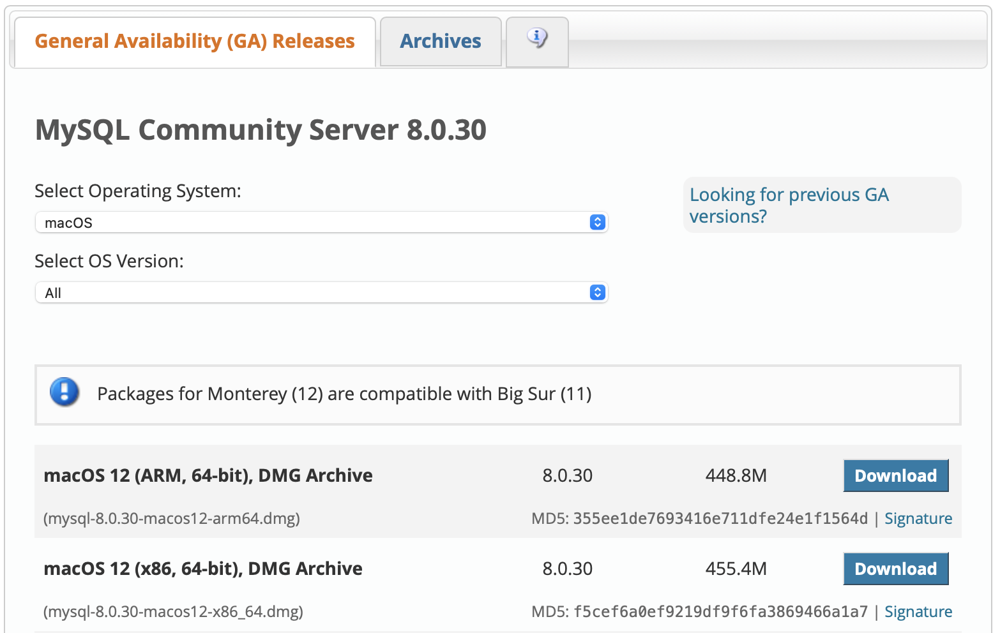

# Data and Knowledge Management Lecture

 
 A gentle introduction to medical databases by Clayton Hamilton, PharmD.   Instructions verified to be working as of September 2022.   Please submit any identified problems via Issue.

## Learn SQL by creating your first database

The goal of this assignment is to create and interact with a database on your machine using MySQL. I chose MySQL because it's relatively straightforward to setup and plays nicely with Mac, Windows, and Linux.

>I set up the MySQL instance on my MacBook. You may need to do a little Googling if you’re using a different system (Windows, Linux) to determine which DMG Archive file is appropriate for your machine.

1) Download lecture files onto your machine
2) Installing the necessary software
   - MySQL Database software
   - SQL Editor (MySQL Workbench)
3) Open the file `DataManipulationScript.sql` in the MySQL Workbench and follow along!

### Download files

Begin by downloading and placing all lecture files in this repository into a new folder named "SQL" in any location (desktop is fine).

### MySQL Installation Steps

1. Download and install the DMG Archive file for your specific operating system found at <https://dev.mysql.com/downloads/mysql/>. For example, my Mac doesn't have the latest ARM chip so the appropriate install choice for me is "macOS 12 (x86, 64-bit)".

2. When the download page appears, scroll to the bottom and click “**No thanks, just start my download**”.
3. You can and should validate any files downloaded from the internet to ensure that your download is exactly as expected with no modifications by malicious parties. At a high-level the MD5 is a cryptographic algorithm that receives data of any length and converts it to a 128-bit hash value (checksum). Notice that the download checksum provided by MySQL as seen in the picture above is `f5cef6a0ef9219df9f6fa3869466a1a7`. If even a single letter has been modified in the received download the hash value will differ from the original document hash value. [This article describes how to retrieve your downloads MD5 checksum on Windows or Mac.](https://portal.nutanix.com/page/documents/kbs/details?targetId=kA07V000000LWYqSAO) Once you retrieve the MD5 checksum for your downloaded document you can [compare it to the original checksum using this site](https://text-compare.com). If there's a match, great! Your download is exactly as expected and you are clear to proceed.
4. During the install process you will create a password when you reach the "Configuration" step. You will need this password to connect to the MySQL instance later.

### MySQL Workbench Installation Steps

 MySQL Workbench is the SQL Editor you will use to connect to your database and query data.

1. Download and install MySQL Workbench from <https://dev.mysql.com/downloads/workbench/>.
2. When the download page appears, just click “No thanks, just start my download”.
3. Compare MD5 checksums using the process outlined in step 3 above.
4. Open your new application named MySQLWorkbench.
5. Under MySQL Connections you should see your local instance 3306. Click your local instance and enter your password you created in step 4 in the previous section if prompted.
6. The Workbench editor should open. This is where you will execute your SQL commands.
7. Select `File` -> `Open SQL Script` -> Navigate to the “SQL” folder containing the lecture materials that you downloaded -> Open the file named `DataManipulationScript.sql`.
